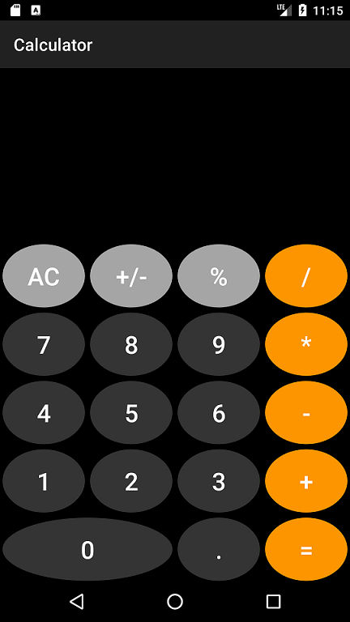
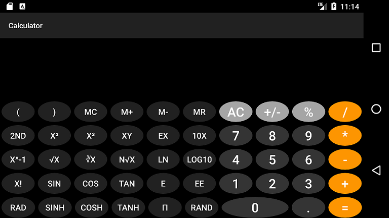

# Calculator_Android_App
Basic and scientific android calculator app with unit testing all written using Kotlin
 

## Portrait Layout -- Basic Calculator

 

## Landscape Layout -- Scientific Calculator

 

## Unique Features
* Uses [EvalEx](https://github.com/uklimaschewski/EvalEx)
  * [EvalEx](https://github.com/uklimaschewski/EvalEx) is a handy expression evaluator for Java, that allows to evaluate simple mathematical and boolean expressions
  * Finding this tool was a big relief because it uses BigDecimal precision.  I was using [exp4j](https://github.com/fasseg/exp4j), but the double precision led to floating point rounding errors.
  * Calculations based on text input.  Uses [Reverse Polish Notation (RPN)](https://en.wikipedia.org/wiki/Reverse_Polish_notation).
* Has two different layouts for portrait and landscape.  I had a hard time finding code examples on the internet that had both these features
* Attempting to include unit testing because it was very difficult to find good articles explaining how to do these.  **(still in development)**
 

## Important build information
* Windows 10
* Kotlin code for back-end
* Android Studio 3.4.1
* target SDK 24
* min/max SDK 21/29
* Packages added to build.gradle listed in the Wiki **(still in development)**
* layout designed checked on:
  * Nexus 5, xxhdpi
  * Nexus 5X, 420dpi
  * Pixel 2, 420dpi
  * Nexus 7, tvhdpi
* Used the following virtual devices in the Android Studio Emulator

Name | Resolution | API | Target
-----|------------|-----|-------
Nexus 5X | 1080 x 1920: 420dpi | 24 | Android 7.0
Nexus 5 | 1080 x 1920: xxhdpi | 21 | Android 5.0
Pixel 2 | 1080 x 1920: 420dpi | 24 | Android 7.0
Pixel 2 | 1080 x 1920: 420dpi | 29 | Android 9.+
