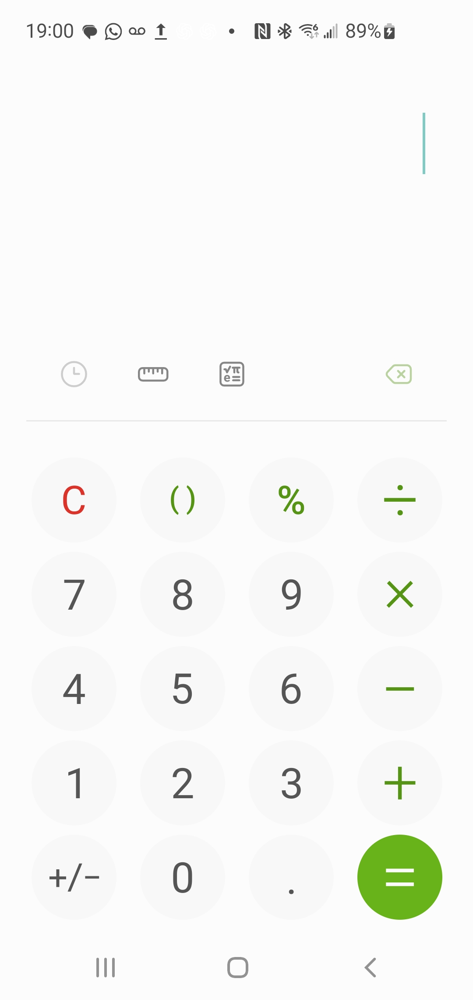
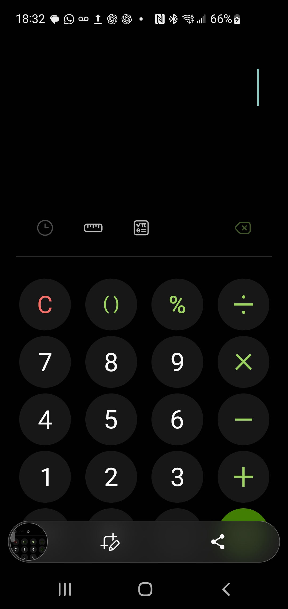
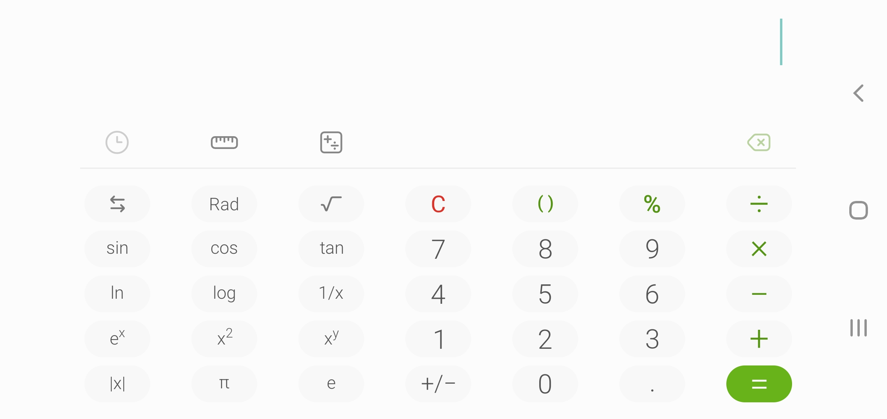
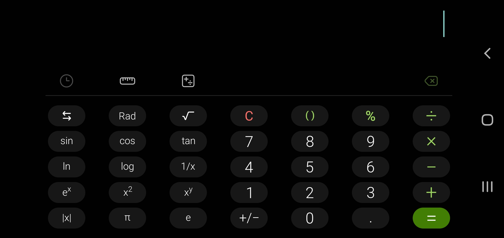

# Calculator Android App

[](LICENSE)
[](https://kotlinlang.org/)
[](https://android-arsenal.com/api?level=21)
[](https://developer.android.com/about/versions/15)

A precision-focused Android calculator with **dual portrait/landscape layouts** (basic & scientific) and **arbitrary-precision arithmetic** using BigDecimal. Written entirely in Kotlin.

| Basic Calculator (Light) | Basic Calculator (Dark) |
|---|---|
|  |  |

| Scientific Calculator (Light) | Scientific Calculator (Dark) |
|---|---|
|  |  |

## Features

- **BigDecimal precision arithmetic** — uses [EvalEx](https://github.com/uklimaschewski/EvalEx) for exact decimal calculations (no floating-point rounding errors)
- **Reverse Polish Notation (RPN)** evaluation for reliable expression parsing
- **Dual-mode UI** — basic four-function calculator in portrait, full scientific calculator in landscape
- **Modern Android stack** — Kotlin, AndroidX, Material Design compatible
- **Unit tested** — includes parameterized JUnit tests for calculation validation

## Architecture

The app uses a single-Activity design. `MainActivity` is a thin UI layer that wires button clicks to `CalculatorEngine` and renders its state; all calculation logic and state live in `CalculatorEngine`, which delegates expression evaluation to EvalEx.

### Key Components
- **CalculatorEngine** (`app/src/main/java/com/example/calculator_v01/CalculatorEngine.kt`) — state machine for calculator input/eval, EvalEx integration
- **MainActivity** (`app/src/main/java/com/example/calculator_v01/MainActivity.kt`) — button handlers and rendering only, no calc logic
- **Layouts** — `activity_main.xml` (portrait) and `layout-land/activity_main.xml` (landscape)
- **Tests** — `CalculatorEngineTest.kt` (state behavior) and `CalculatorEvalTest.kt` (parameterized arithmetic evaluation)

## Build Information

| Property | Value |
|---|---|
| Gradle | 8.7+ |
| AGP (Android Gradle Plugin) | 8.5+ |
| Kotlin | 2.0.0 |
| Compile SDK | 35 |
| Min SDK | 21 |
| Target SDK | 35 |
| Java/Kotlin JVM | 17 |

## Quick Start

### Prerequisites
- JDK 17 or higher
- Android SDK 21+ (minimum API level)
- Android build tools 35+

### Build & Run

```bash
# Clone the repo
git clone https://github.com/StephenGemin/Calculator_Android_App.git
cd Calculator_Android_App

# Build a debug APK
./gradlew assembleDebug

# Install on an emulator or connected device
./gradlew installDebug

# Launch the app
adb shell am start -n com.example.calculator_v01/.MainActivity
```

### Using Android Studio
1. Open the project in Android Studio
2. Click **Run** or press **Shift + F10** to build and launch on an emulator or device

## Testing

### Unit Tests

Run the automated test suite:
```bash
./gradlew testDebugUnitTest
```

The test suite validates core arithmetic operations (addition, subtraction, multiplication, division, percent) across various input combinations.

### Manual Testing

With the emulator running and the app installed, test the UI interactively:

1. **Portrait (Basic Calculator)**
   - Enter a calculation: `5 + 3` → tap `=` → verify result is `8`
   - Test decimal: `2.5 × 4` → verify no floating-point errors
   - Test percent: `200` → tap `%` → verify result
   - Test sign toggle: enter `5` → tap `±` → verify becomes `-5`
   - Test clear: tap `C` → verify display clears

2. **Landscape (Scientific Calculator)**
   - Rotate device to landscape (click rotate button or `Ctrl + Right Arrow`)
   - Verify scientific buttons appear and work correctly
   - Test a scientific operation to ensure all layouts render properly

3. **Edge Cases**
   - Division by zero → should display "Error"
   - Very large numbers → verify BigDecimal precision holds
   - Consecutive operators → verify app handles gracefully

## Acknowledgments

- [EvalEx](https://github.com/uklimaschewski/EvalEx) — expression evaluation library with BigDecimal precision
- [Android Developers](https://developer.android.com) — comprehensive Android documentation
