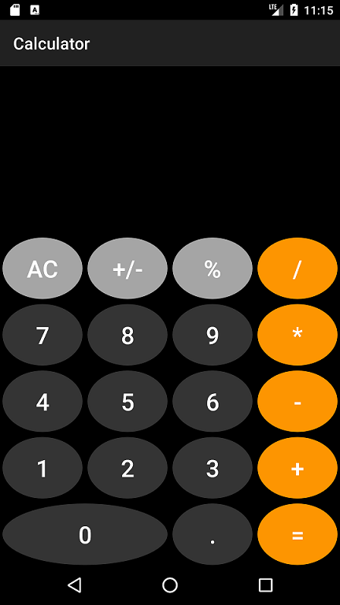
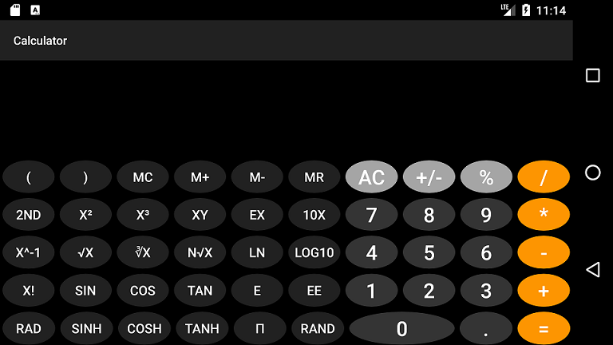

# Calculator Android App

[](LICENSE)
[](https://kotlinlang.org/)
[](https://android-arsenal.com/api?level=21)
[](https://developer.android.com/about/versions/15)

A precision-focused Android calculator with **dual portrait/landscape layouts** (basic & scientific) and **arbitrary-precision arithmetic** using BigDecimal. Written entirely in Kotlin.

| Basic (Portrait) | Scientific (Landscape) |
|---|---|
|  |  |

## Features

- **BigDecimal precision arithmetic** — uses [EvalEx](https://github.com/uklimaschewski/EvalEx) for exact decimal calculations (no floating-point rounding errors)
- **Reverse Polish Notation (RPN)** evaluation for reliable expression parsing
- **Dual-mode UI** — basic four-function calculator in portrait, full scientific calculator in landscape
- **Modern Android stack** — Kotlin, AndroidX, Material Design compatible
- **Unit tested** — includes parameterized JUnit tests for calculation validation

## Quick Start

### Prerequisites
- JDK 17 or higher
- Android SDK 21+ (minimum API level)
- Android build tools 35+

### Build & Run

```bash
# Clone the repo
git clone https://github.com/StephenGemin/Calculator_Android_App.git
cd Calculator_Android_App

# Build a debug APK
./gradlew assembleDebug

# Install on an emulator or connected device
./gradlew installDebug

# Launch the app
adb shell am start -n com.example.calculator_v01/.MainActivity
```

### Using Android Studio
1. Open the project in Android Studio
2. Click **Run** or press **Shift + F10** to build and launch on an emulator or device

## Build Information

| Property | Value |
|---|---|
| Gradle | 8.7+ |
| AGP (Android Gradle Plugin) | 8.5+ |
| Kotlin | 2.0.0 |
| Compile SDK | 35 |
| Min SDK | 21 |
| Target SDK | 35 |
| Java/Kotlin JVM | 17 |

## Architecture

The app uses a single-Activity design with the calculator logic embedded in `MainActivity.kt`. The UI responds to button clicks, maintains calculation state, and delegates expression evaluation to EvalEx.

### Key Components
- **MainActivity** (`app/src/main/java/com/example/calculator_v01/MainActivity.kt`) — UI state, button handlers, EvalEx integration
- **Layouts** — `activity_main.xml` (portrait) and `layout-land/activity_main.xml` (landscape)
- **Tests** — `MainActivityTest.kt` — parameterized unit tests for arithmetic operations

## Testing

Run the unit tests:
```bash
./gradlew testDebugUnitTest
```

The test suite validates core arithmetic operations (addition, subtraction, multiplication, division, percent) across various input combinations.

## License

This project is licensed under the **MIT License** — see [LICENSE](LICENSE) for details. Feel free to use, modify, and distribute this code.

## Contributing

Contributions are welcome! Feel free to open issues or submit pull requests.

## Acknowledgments

- [EvalEx](https://github.com/uklimaschewski/EvalEx) — expression evaluation library with BigDecimal precision
- [Android Developers](https://developer.android.com) — comprehensive Android documentation
